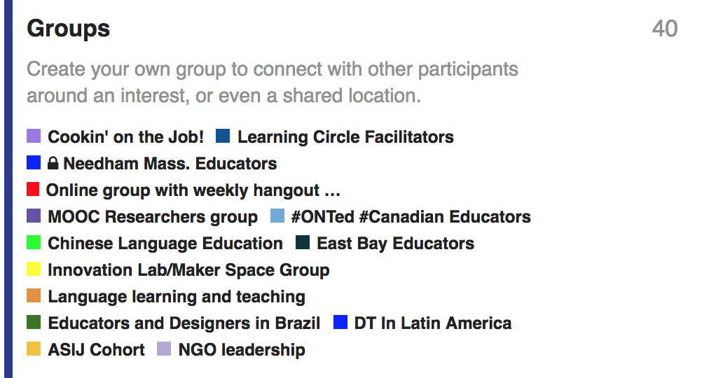
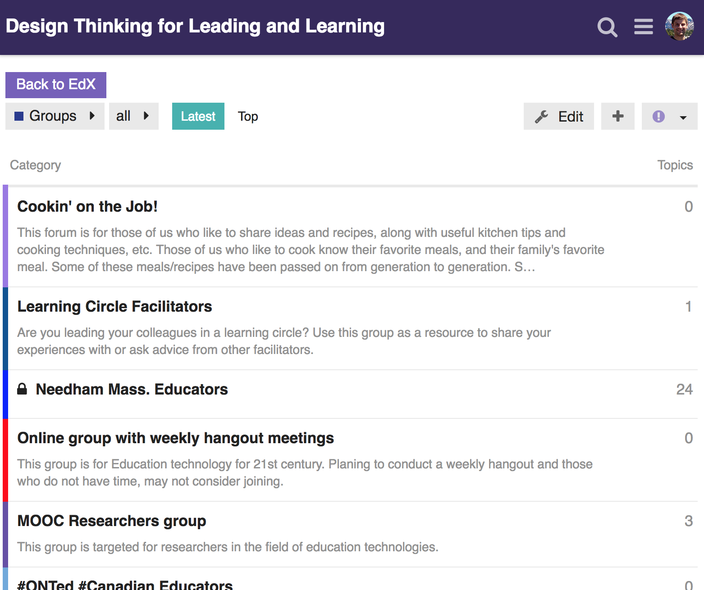
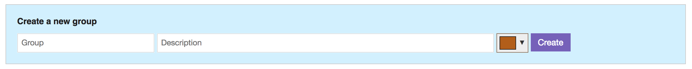
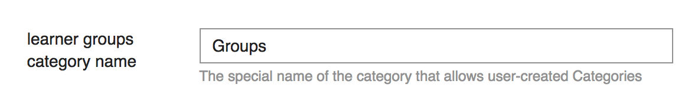
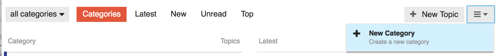
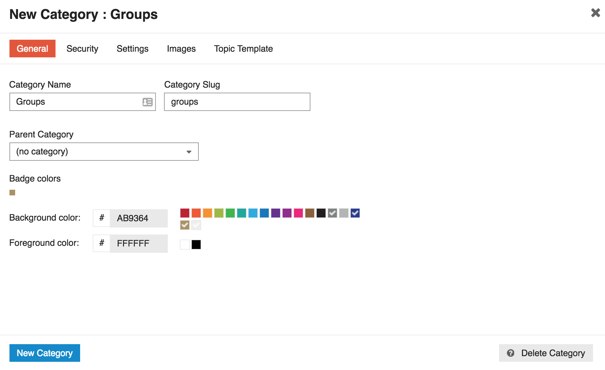
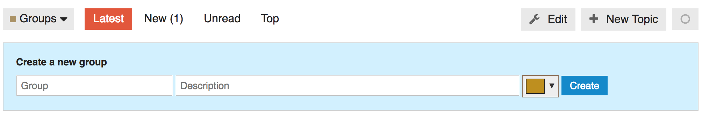
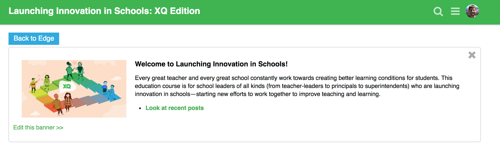

# discourse-tsl-mods
Discourse plugin with mods for TSL's EdX courses.  It contains a few different pieces:

- Forces SSL
- Sets backups to be daily by default
- Adds a feature for learners to create their own groups
- Adds a Back to EdX button
- Adds CSS for a banner post with a particular layout

## Force SSL
See [config/settings.yml](config/settings.yml).

## Backups
See [this post](https://meta.discourse.org/t/configure-automatic-backups-for-discourse/14855).

Backing up to S3 is recommended, along with creating a new IAM user with a limited policy like this:

```
{
    "Version": "2012-10-17",
    "Statement": [
        {
            "Effect": "Allow",
            "Action": [
                "s3:ListBucket",
                "s3:GetBucketLocation",
                "s3:ListBucketMultipartUploads"
            ],
            "Resource": [
                "arn:aws:s3:::whatever-the-course-is-called-backups"
            ],
            "Condition": {}
        },
        {
            "Action": [
                "s3:AbortMultipartUpload",
                "s3:DeleteObject*",
                "s3:GetObject*",
                "s3:PutObject*"
            ],
            "Effect": "Allow",
            "Resource": [
                "arn:aws:s3:::whatever-the-course-is-called-backups/*"
            ]
        }
    ]
}
```

## Groups
### Learner user experience
#### 1. Learner sees a Groups category


#### 2. Learner sees Groups that other learners have created


#### 3. Learner can create their own Group



### Course author user experience
#### 1. Author sets the name of the special "Groups" category


#### 2. Author creates a new category with that name



#### 3. Learners can now create their own groups



## Back to EdX button


## Banner layout
Create a post and then pin it as a banner.  Doing this requires setting the whitespace exactly as below; this is somewhat brittle but the idea is to get a banner post that looks like this:



Here's the post content, which needs to be exactly like this for the CSS in [stylesheets/banner-layout.css](stylesheets/banner-layout.css) to work correctly:
```
<div>

<div><div>Welcome to Launching Innovation in Schools!</div>

Every great teacher and every great school constantly work towards creating better learning conditions for students. This education course is for school leaders of all kinds (from teacher-leaders to principals to superintendents) who are launching innovation in schools—starting new efforts to work together to improve teaching and learning. 


* See [**Unit 0**](https://launching-innovation-discourse.teachingsystemslab.org/c/unit-0-welcome) for an introduction to some key frameworks of the course and to meet your classmates
* **[Look at recent posts](https://launching-innovation-discourse.teachingsystemslab.org/latest)**

</div>
</div>
```
Add this to a theme in the `Desktop` > `After Header` section, replacing the button text and course URL for your course:
```
<a
  style="display: inline-block;
    position: relative;
    display: inline-block;
    background: #28a9e0;
    color: white;
    padding: 5px 12px;
    font-size: 1.143em;
    margin-bottom: 5px;"
   href="https://edge.edx.org/courses/course-v1:MITx+11154x_XQ+2017MAY/info">Back to Edge</a>
```

## Local development
You can develop with Vagrant ([see Discourse docs](https://github.com/discourse/discourse/blob/master/docs/VAGRANT.md)).  As you develop, clear the ERB cache, copy this repository to the `plugins` folder and restart Rails to see changes.

On OSX you may also need to enable NFS for volume sharing, by adding an option to the Discourse Vagrantfile:

```
config.vm.synced_folder ".", "/vagrant", id: "vagrant-root", nfs: true
```

Example (also using `discourse-edx-lti`):
```
rm -rf tmp/cache && \
rm -rf plugins && \
git checkout head -- plugins && \
rsync -av --exclude .git \
  ~/github/mit-teaching-systems-lab/discourse-edx-lti \
  ./plugins/ && \
rsync -av --exclude .git \
  ~/github/mit-teaching-systems-lab/discourse-tsl-mods \
  ./plugins/ && \
vagrant ssh -c 'cd /vagrant && bundle exec rails s -b 0.0.0.0'
```
